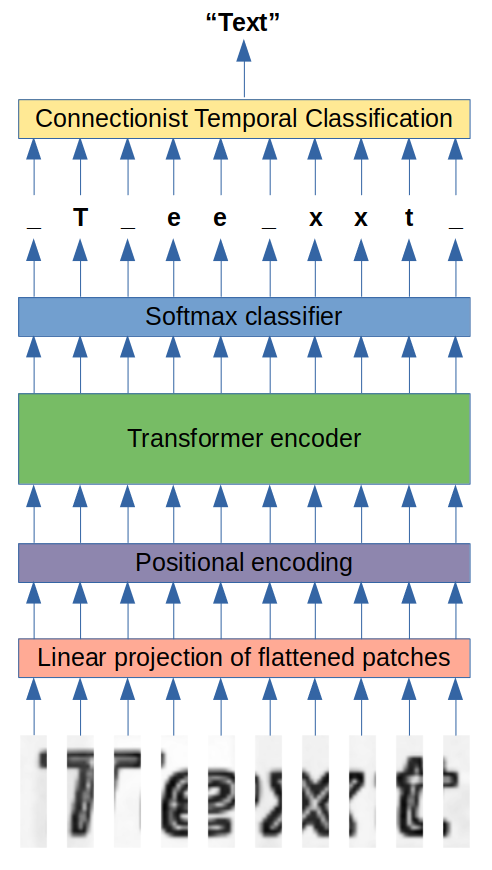

# Vision Transfomer for Scene Text Recognition

This project aims to explore application of the Vision Transformer (ViT) architecture for Scene Text Recognition problems. The model is implemented with Tensorflow 2 and is similar to the original ViT with some changes to fit the new type of problem:

For more details on model architecture and training process, please, checkout the <a href="notebooks/train_mjsynth.ipynb">training notebook</a>.
The model was tested on the IIIT 5K-word dataset and achieved 80.97% accuracy. More details are available in the <a href="notebooks/test_iiit5k.ipynb">testing notebook</a>.

